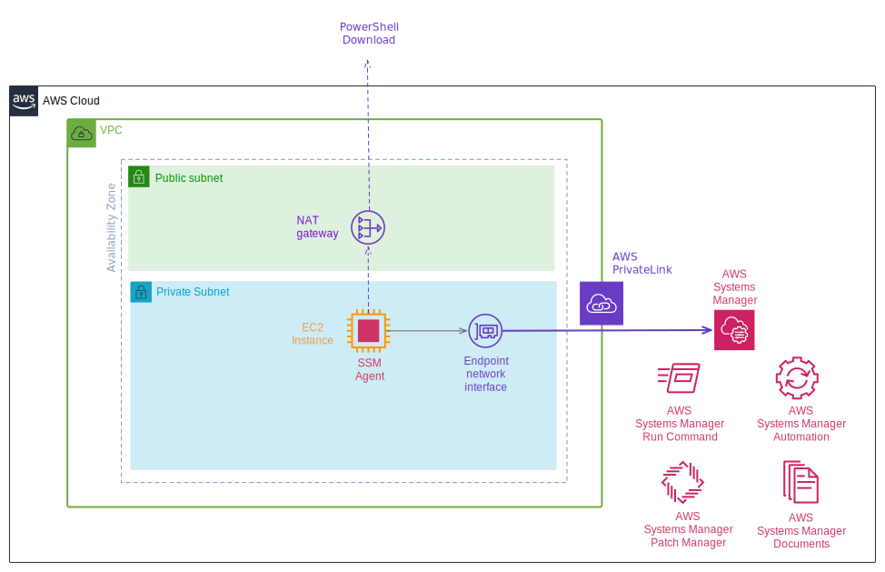

# AWS-SSM-Backup-Update
AWS SSM Automation that performs AMI backup and OS Update simultaneously on multiple Windows EC2 Instances.

This solution automates OS updates for large numbers of EC2 instances.
Use Automation Document of AWS Systems Manager (SSM).
In addition, SSM Patch Manager manages patches to be applied by OS update.



## Deploying

### Requirements
- AWS Account  
- AWS CLI latest  

### Instructions

These are the deployment steps until the full implementation is complete.  

#### Parameter description

PROJECTNAME: The name of the system.  
ROLENAME: Classification of instances.  
ENVIRONMENT: The name of the environment.  

#### Set variables

Locally(terminal), run following commands.  

```bash
$ PROJECTNAME=ac
$ ROLENAME=ifsv
$ ENVIRONMENT=dev
```

#### Create a VPC environment

```bash
$ aws cloudformation create-stack \
    --stack-name $PROJECTNAME-$ROLENAME-$ENVIRONMENT-vpc \
    --region ap-northeast-1 \
    --template-body file://vpc_privatelink.yml \
    --capabilities CAPABILITY_NAMED_IAM \
    --parameters \
    ParameterKey=ProjectName,ParameterValue=$PROJECTNAME \
    ParameterKey=RoleName,ParameterValue=$ROLENAME \
    ParameterKey=Environment,ParameterValue=$ENVIRONMENT
```

#### Create SSM Automation  

```
$ aws cloudformation create-stack \
    --stack-name $PROJECTNAME-$ENVIRONMENT-SSM-Automation \
    --region ap-northeast-1 \
    --template-body file://SSM-BackupUpdate.yml \
    --capabilities CAPABILITY_NAMED_IAM
```

## How to use  
- Select and execute the created Document from the SSM Management Console Document.

- OS Updateする対象のインスタンスを追加するには、インスタンスに以下のTagを設定する。  
"Project": "ac"  
"Environment": "dev"  
"Patch Group": 'windows-patch-baseline'  

## Outline

#### SSM Automation Document - mainSteps:    
1. Search for instances to update OS  
1. Stop the target instance  
1. Get the AMI before updating  
1. Launch the instance  
1. Perform OS update  
1. Stop the instance  

#### Environment
- Create an instance of Windows OS on the Private Subnet.  
- Create an AWS Private Link (ENI) to make the private connection between the instance in the AWS VPC and the SSM.  
- SSM Agent running on Windows Instance creates NAT Gateway in Public Subnet to download   PowerShell etc.  
- SSM Agent needs to access S3. Please refer to the following AWS Document for IAM Role   required for Instance.  
[About Minimum S3 Bucket Permissions for SSM Agent](https://docs.aws.amazon.com/systems-manager/latest/userguide/ssm-agent-minimum-s3-permissions.html)  

#### About SSM Patch Manager
- Create PatchBaseline for Windows patch management.  
- To associate PatchBaseline with an instance, set the PatchGroup name to Instances Tag: 'Patch Group'.  
